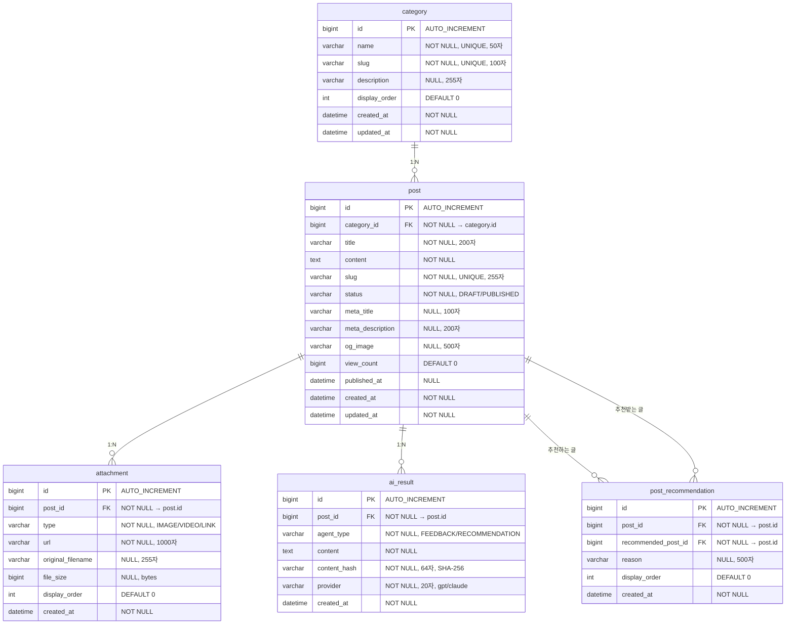

# ERD (Entity Relationship Diagram)

## 다이어그램

## 테이블 설명

### 1. category (카테고리)
| 컬럼 | 타입 | 제약조건 | 설명 |
|---|---|---|---|
| id | BIGINT | PK, AUTO_INCREMENT | |
| name | VARCHAR(50) | NOT NULL, UNIQUE | 카테고리명 (Java, 독서, 알고리즘 등) |
| slug | VARCHAR(100) | NOT NULL, UNIQUE | URL용 식별자 (java, reading, algorithm) |
| description | VARCHAR(255) | NULL | 카테고리 설명 |
| display_order | INT | DEFAULT 0 | 표시 순서 |
| created_at | DATETIME | NOT NULL | |
| updated_at | DATETIME | NOT NULL | |

### 2. post (게시글)
| 컬럼 | 타입 | 제약조건 | 설명 |
|---|---|---|---|
| id | BIGINT | PK, AUTO_INCREMENT | |
| category_id | BIGINT | FK, NOT NULL | category.id 참조 |
| title | VARCHAR(200) | NOT NULL | 게시글 제목 |
| content | TEXT | NOT NULL | 게시글 본문 (Markdown) |
| slug | VARCHAR(255) | NOT NULL, UNIQUE | SEO용 URL 식별자 |
| status | VARCHAR(20) | NOT NULL | DRAFT(초안) / PUBLISHED(발행) |
| meta_title | VARCHAR(100) | NULL | SEO 메타 타이틀 (미입력 시 title 사용) |
| meta_description | VARCHAR(200) | NULL | SEO 메타 설명 |
| og_image | VARCHAR(500) | NULL | OG 이미지 URL |
| view_count | BIGINT | DEFAULT 0 | 조회수 (Redis에서 주기적 동기화) |
| published_at | DATETIME | NULL | 발행 일시 |
| created_at | DATETIME | NOT NULL | |
| updated_at | DATETIME | NOT NULL | |

### 3. attachment (첨부파일)
| 컬럼 | 타입 | 제약조건 | 설명 |
|---|---|---|---|
| id | BIGINT | PK, AUTO_INCREMENT | |
| post_id | BIGINT | FK, NOT NULL | post.id 참조 |
| type | VARCHAR(20) | NOT NULL | IMAGE / VIDEO / LINK |
| url | VARCHAR(1000) | NOT NULL | 파일 경로 또는 외부 URL |
| original_filename | VARCHAR(255) | NULL | 업로드 원본 파일명 (LINK 타입은 NULL) |
| file_size | BIGINT | NULL | 파일 크기 bytes (LINK 타입은 NULL) |
| display_order | INT | DEFAULT 0 | 표시 순서 |
| created_at | DATETIME | NOT NULL | |

### 4. ai_result (AI 에이전트 결과)
| 컬럼 | 타입 | 제약조건 | 설명 |
|---|---|---|---|
| id | BIGINT | PK, AUTO_INCREMENT | |
| post_id | BIGINT | FK, NOT NULL | post.id 참조 |
| agent_type | VARCHAR(20) | NOT NULL | FEEDBACK / RECOMMENDATION |
| content | TEXT | NOT NULL | AI 응답 내용 |
| content_hash | VARCHAR(64) | NOT NULL | 요청 시점 게시글 내용의 SHA-256 해시 |
| provider | VARCHAR(20) | NOT NULL | 사용된 AI 제공자 (gpt / claude) |
| created_at | DATETIME | NOT NULL | |

### 5. post_recommendation (게시글 추천)
| 컬럼 | 타입 | 제약조건 | 설명 |
|---|---|---|---|
| id | BIGINT | PK, AUTO_INCREMENT | |
| post_id | BIGINT | FK, NOT NULL | 기준 게시글 (post.id) |
| recommended_post_id | BIGINT | FK, NOT NULL | 추천 게시글 (post.id) |
| reason | VARCHAR(500) | NULL | 추천 사유 |
| display_order | INT | DEFAULT 0 | 표시 순서 |
| created_at | DATETIME | NOT NULL | |

## 설계 근거

### MySQL에 저장하는 데이터
- 카테고리, 게시글, 첨부파일: 핵심 영속 데이터
- AI 결과: 피드백/추천 응답 영구 보관 (이력 관리)
- 게시글 추천: 추천 에이전트 결과의 정규화된 관계

### Redis에 저장하는 데이터 (테이블 아님)
- **방문자 통계**: `visitor:total`, `visitor:today:{date}`, `visitor:post:{postId}` → 실시간 집계
- **AI 응답 캐시**: `ai:{agentType}:{postId}:{contentHash}` → 동일 요청 재호출 방지
- **view_count 동기화**: Redis → MySQL 주기적 반영

### 사용자 테이블 없음
- 단일 관리자 계정은 application.yml에 고정
- JWT 인증만 사용하므로 별도 사용자 테이블 불필요

### 인덱스 후보
- `post.category_id` : 카테고리별 게시글 조회
- `post.slug` : SEO URL 조회 (UNIQUE이므로 자동 인덱스)
- `post.status` : 발행된 글만 조회
- `post.published_at` : 최신순 정렬
- `attachment.post_id` : 게시글별 첨부 조회
- `ai_result.post_id, ai_result.agent_type` : 게시글별 AI 결과 조회
- `post_recommendation.post_id` : 게시글별 추천 목록 조회
