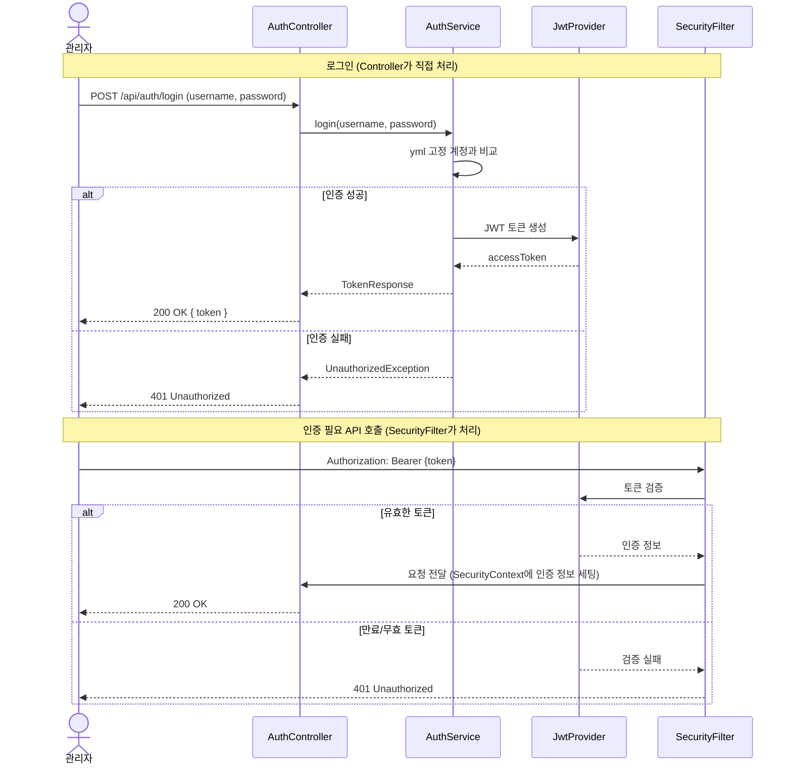
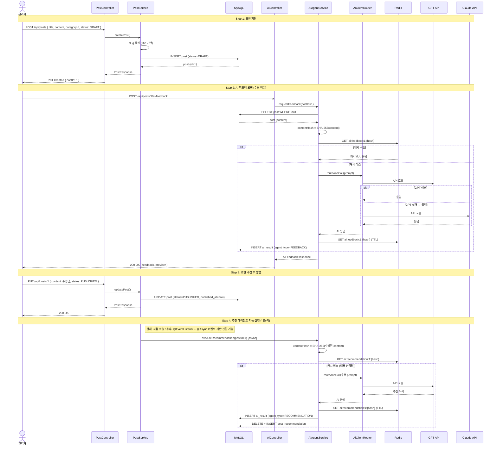
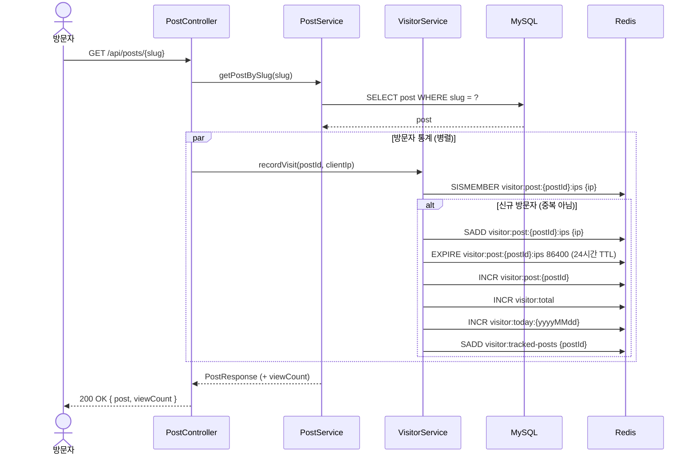
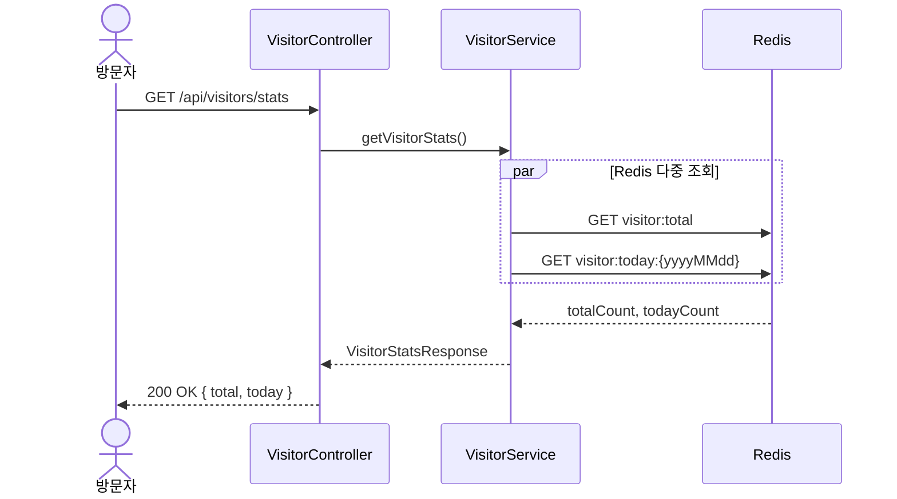
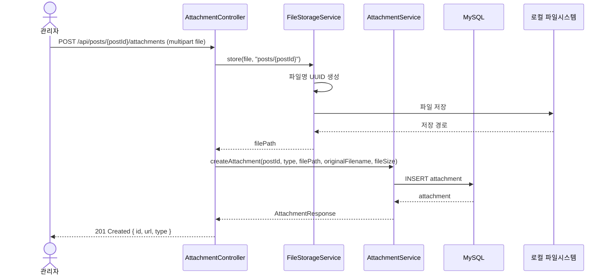
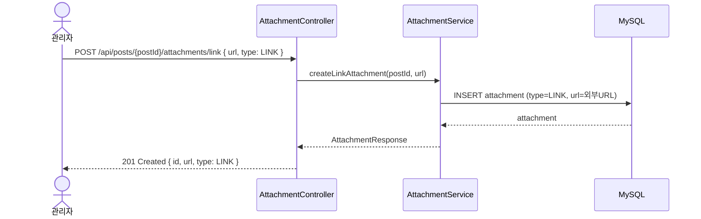
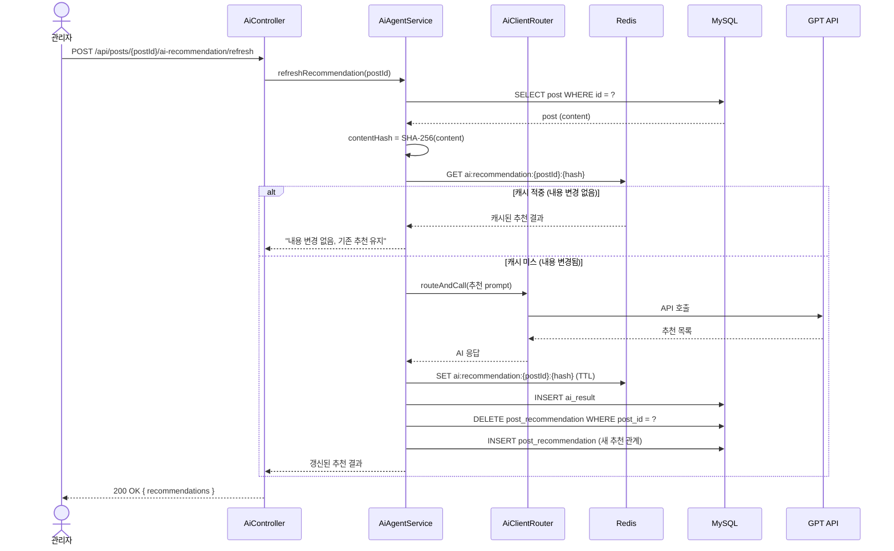
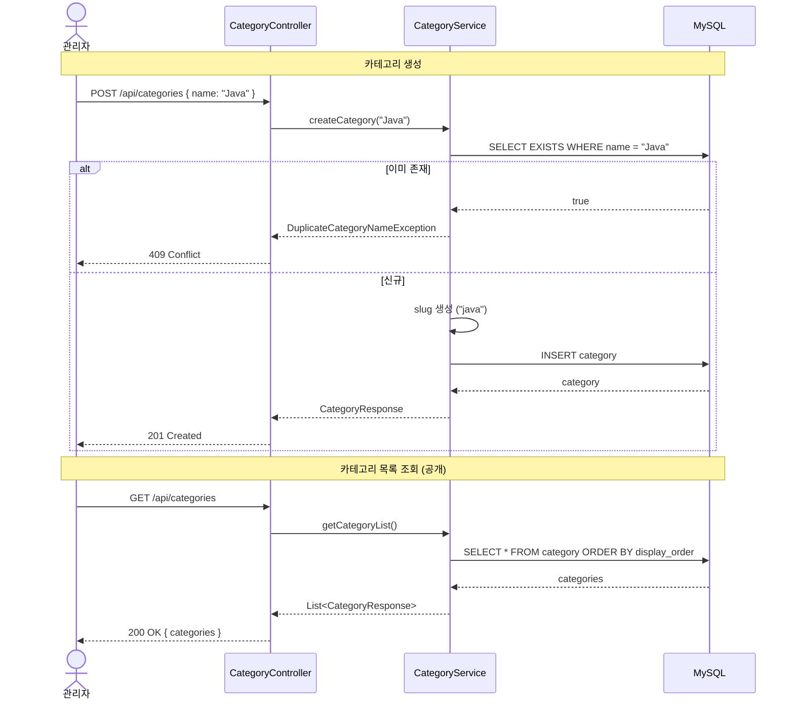
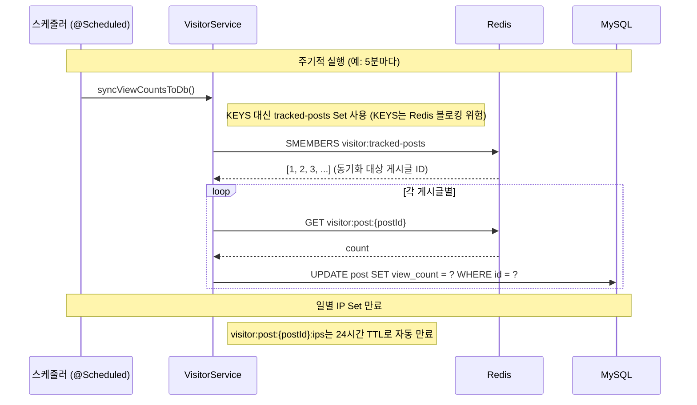
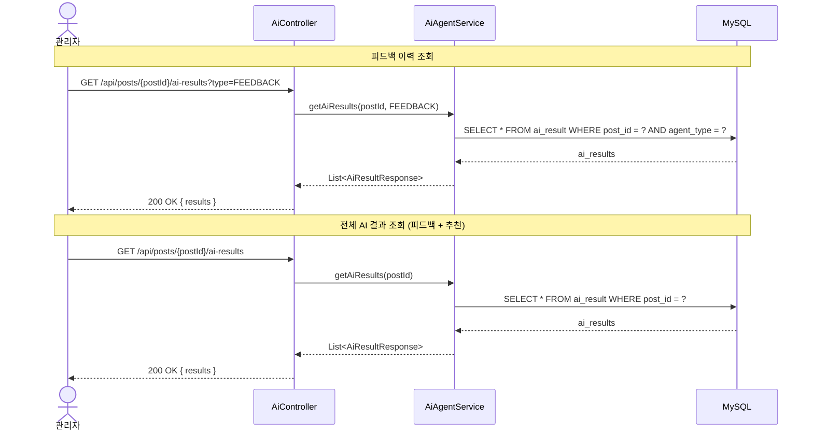

# 시퀀스 다이어그램

## 1. 인증 흐름

## 2. 게시글 작성 전체 흐름 (핵심)

## 3. 게시글 조회 + 방문자 통계

## 4. 방문자 통계 조회

## 5. 파일 업로드 + 게시글 첨부

## 6. 외부 링크 첨부

## 7. AI 추천 수동 갱신 (게시글 수정 후)

## 8. 카테고리 CRUD

## 9. Redis → MySQL 조회수 동기화 (배치)

## 10. AI 결과 조회

## API 엔드포인트 요약

| 메서드 | 경로 | 인증 | 설명 |
|---|---|---|---|
| POST | `/api/auth/login` | X | 관리자 로그인 |
| GET | `/api/categories` | X | 카테고리 목록 |
| POST | `/api/categories` | O | 카테고리 생성 |
| PUT | `/api/categories/{id}` | O | 카테고리 수정 |
| DELETE | `/api/categories/{id}` | O | 카테고리 삭제 |
| GET | `/api/posts` | X | 게시글 목록 (발행된 것만) |
| GET | `/api/posts/{slug}` | X | 게시글 상세 (slug) |
| GET | `/api/categories/{id}/posts` | X | 카테고리별 게시글 목록 |
| POST | `/api/posts` | O | 게시글 생성 |
| PUT | `/api/posts/{id}` | O | 게시글 수정 |
| DELETE | `/api/posts/{id}` | O | 게시글 삭제 |
| POST | `/api/posts/{id}/attachments` | O | 파일 첨부 |
| POST | `/api/posts/{id}/attachments/link` | O | 링크 첨부 |
| DELETE | `/api/attachments/{id}` | O | 첨부 삭제 |
| POST | `/api/posts/{id}/ai-feedback` | O | AI 피드백 요청 |
| GET | `/api/posts/{id}/ai-results` | O | AI 결과 조회 (피드백/추천 이력) |
| GET | `/api/posts/{id}/ai-results?type={type}` | O | AI 결과 타입별 조회 |
| POST | `/api/posts/{id}/ai-recommendation/refresh` | O | AI 추천 수동 갱신 |
| GET | `/api/posts/{id}/recommendations` | X | 추천 글 목록 |
| GET | `/api/visitors/stats` | X | 방문자 통계 |
| GET | `/sitemap.xml` | X | 사이트맵 |
| GET | `/robots.txt` | X | 로봇 파일 |
